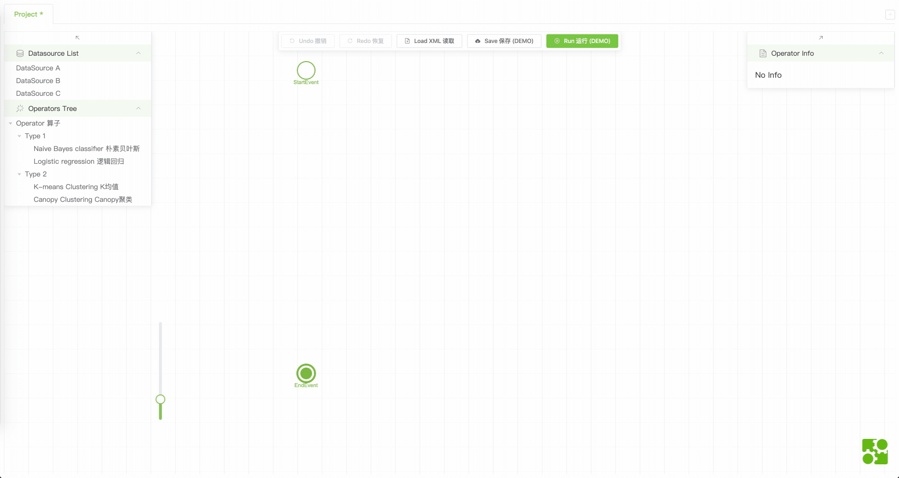
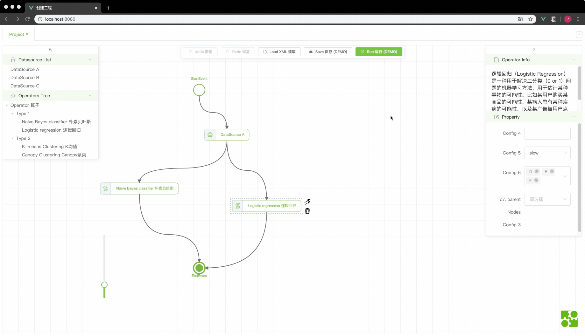
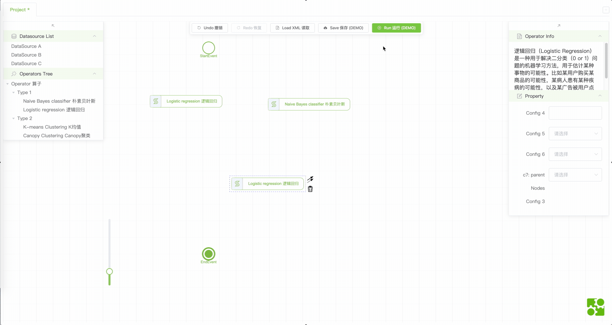
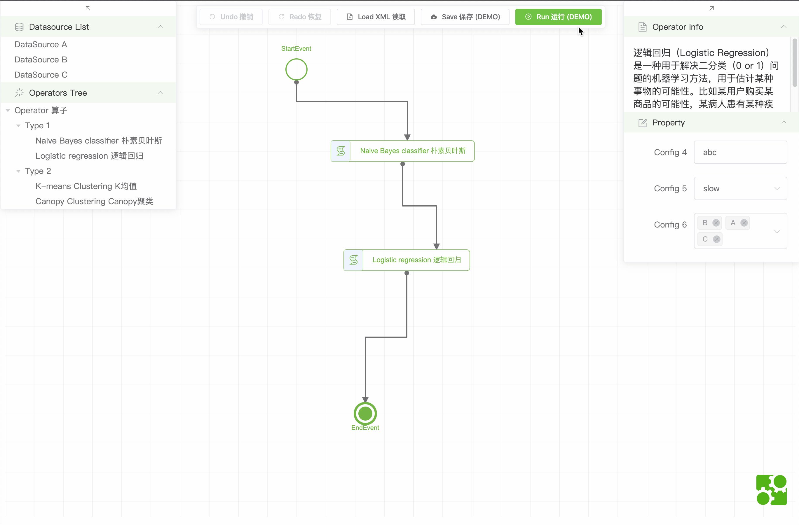
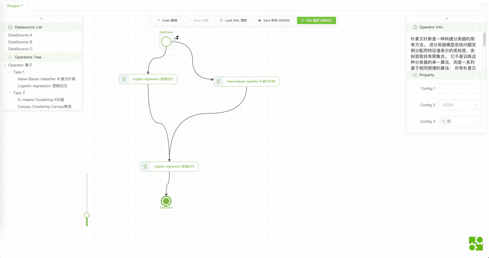
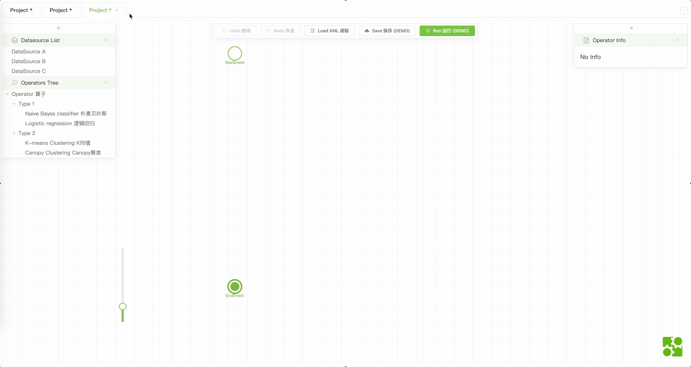

# bpmn-dataflow-diagram-editor

Other languages: [中文文档](README.zh.md)

This demo is an integrated dataflow diagram editor. It is built upon customized bpmn-js and Vue.js. You will need Vue.js knowledge to be able to read and understand source code.

## Features

- Visual Editing: edit a dataflow diagram by click, drag and drop. 
- Save & Load XML: save & load diagram with nodes data. 
- Property & Data Transfer: extendible property panel and data could travel between nodes. 
- Animation: display any CSS styles animation on nodes. (implemented in the **OLD** codebase) 
- Seamless Zooming: Zoom in and out canvas soomthly (soomther than [original step zooming](http://demo.bpmn.io/)) 
- Mutiple Diagrams: Open and edit mutiple diagrams at the same time. 

## Getting Started

```sh
git clone https://github.com/Pingren/BPMNFlowEditor
cd BPMNFlowEditor
yarn & yarn serve
```

## Design

### Project Structure

- [`components`]
  - [`PanelLeft`]
    - [`index.vue`] panel contains panes
    - [`PaneDatabase.vue`] list style node picker
    - [`PaneOperator.vue`] tree style node picker
  - [`PanelRight`]
    - [`index.vue`] panel contains panes
    - [`PaneNodeInfo.vue`] node information viewer
    - [`PaneProperty.vue`] extendible property editor
  - [`PanelTop`]
    - [`index.vue`] panel contains buttons for editing, saving, and more
  - [`DiagramEditor.vue`] containing all the other vue components, responsible for creating diagram object and vuex state during its life cycle
  - [`ZoomSlider.vue`] slider for zooming diagram
- [`module`]
  - [`xxx.js...`] bpmn.js module, customization documented inside each file
  - [`index.js`] custom bpmn.js module helper & disable some modules
- [`store`]
  - [`module.js`] vuex reuseable module
  - [`index.js`] vuex root state, controling dynamic module
- [`App.vue`] app entry, containing el-tabs and each tab has a DiagramEditor
- [`Diagram.js`] Diagram class
- [`mock.js`] mock data from back-end

### Explanation

#### Diagram.js

`Diagram` is a class representing a dataflow diagram. It creates actual bpmn-js objects and bind them to the instance in its constructor. It provides `importXML` and `exportXML` methods, as well as other diagram manipulation methods(e.g. `createNode`) if needed.

A diagram object is created when a tab, namely `DiagramEditor` **mounted**. Then it will be [provided/injected](https://vuejs.org/v2/api/index.html#provide-inject) to all children. Thus all child vue components can use it to control the diagram.

Diagram also has some "private" methods: `evaluateNodeData`, `evaluateNodeInput`, `evaluateNodeOutput`, etc. They get called inside bpmn-js EventBus handlers, and should not be used outside.

#### Vuex State

[Vuex](https://vuex.vuejs.org/) is needed because some diagram states need to be reactive in vue components. Therefore, each diagram object is accompanied with an vuex state store and keeps track of the store by a key.

This project [reuse a same vuex module](https://vuex.vuejs.org/guide/modules.html#module-reuse) since there could be mutiple diagrams because of tabs. A vuex module is [registered](https://vuex.vuejs.org/guide/modules.html#dynamic-module-registration) when a tab, namely `DiagramEditor` **created** and will be removed before vue components destoryed.

A vuex module contains basic states of diagram such as currentNodeId, isRunning, etc. It also contains three node data model objects: inputModel, transferModel, outputModel.

#### Node Data Model

Every node have its own property. Properties are stored in the transferModel. User could change property inside the property pane.

A node can also have inputs and outputs, which stored in the inputModel and outputModel. Inputs and outputs depends on node properties, diagram structure and node input & output config:

- node input config: what and how the collection of a node parents' output (outputModel) are used and transformed into its inputModel.

- node output config: what and how the property (transferModel) of node, are used and transformed into its outputModel.

Both inputModel, outputModel are updated automatically. Core logic is in the Diagram.js based on a Breadth-First Traversal.

## Built With

- [bpmn-js](https://github.com/bpmn-io/bpmn-js) - The main dependency for this project.
- [bpmn-js-cli](https://github.com/bpmn-io/bpmn-js-cli) - a support library to relief development.
- [vue](https://vuejs.org) - a progressive framework for building user interfaces.
- [element-ui](https://element.eleme.io) - a widely used UI Library.

## Miscellaneous

### Related Projects & Products

Below are some projects and products utilize a dataflow-like diagram editor:

- [AI-Blocks](https://github.com/MrNothing/AI-Blocks)

- [Tencent Oceanus-ML](https://data.qq.com/article?id=3921)

- [Azure Machine Learing designer](https://docs.microsoft.com/en-us/azure/machine-learning/concept-designer)

- [Salesforce Dataflow Editor](https://help.salesforce.com/articleView?id=bi_integrate_dataflow_configure_editor.htm)

### Old Version

  The code was refactored and had major changes. You can check old version on branch `archive-codebase`. Please **NOTE** its design and structure is **quite different** from current `master` branch.

### Issues

None for now. Issues and Suggestions are welcome!
