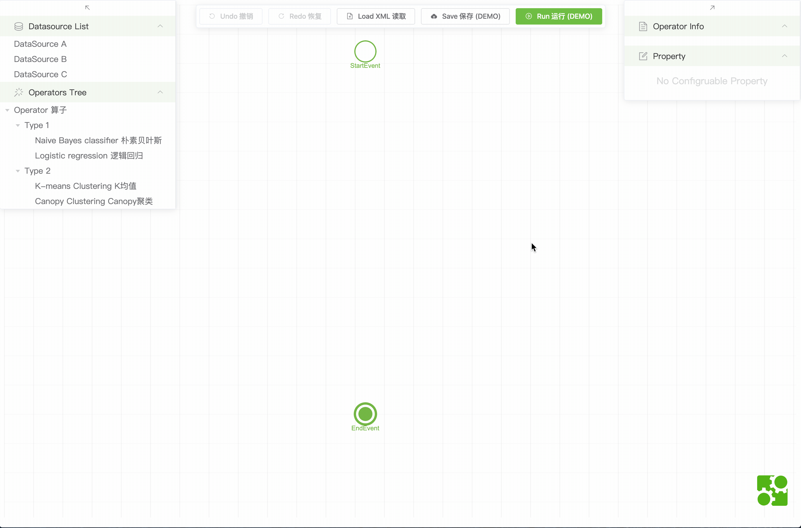
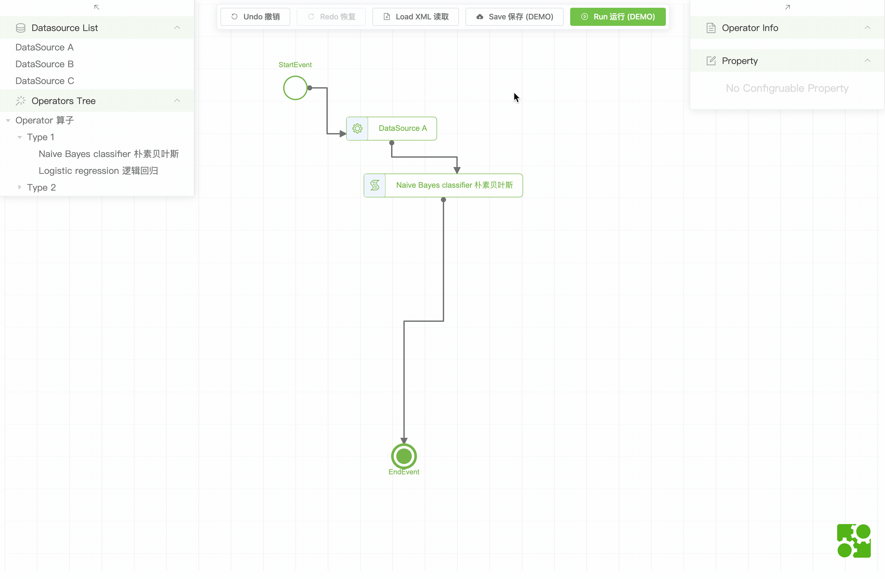

# BPMNFlowEditor

Other languages: [中文文档](README.zh.md)

This project is an example of a flow diagram editor. It is built upon bpmn-js and customized based on what I need. It is an **incomplete** project and is for demostartion and learning only. Since I use Vue.js to create this. You will need some Vue.js knowledge to be able to read and understand source code.

## Features

- Edit: create a flow-like chart by simply drag & click. 
- Save & Load: save to / load from a customized BPMN XML. 
- Property panel: an extendible property panel binding JSON to XML model. 
- Animation: display any CSS styles animation on nodes.

## Getting Started

```sh
git clone https://github.com/Pingren/BPMNFlowEditor
cd BPMNFlowEditor
yarn & yarn serve
```

## Explanation

### Architecture

- [`components`]
  - [`moudle`]
    - [`xxx.js...`] custom BPMN.js modules
    - [`index.js`] custom modules helper & disable some default modules
  - [`BPMNEditor`] core diagram editor with main functionality
  - [`DatabasePicker.vue`] a list style node picker
  - [`OperatorPicker.vue`] a tree style node picker
  - [`PaneLeft.vue`] left panel, containing `DatabasePicker` & `OperatorPicker`
  - [`PaneProperty.vue`] an extendible property editor
  - [`PaneRight.vue`] right panel, containing `PaneProperty`
- [`App.vue`] main app, containing `PaneLeft` & `BPMNEditor` & `PaneRight`
- [`mock.js`] mock data from back-end

### Implementation

#### Dragging Node

- allow dragging inside `DatabasePicker` & `OperatorPicker`.
- the `drop` event is listend on div container of `bpmnModeler`. Please checkout [HTML Drag and Drop API](https://developer.mozilla.org/en-US/docs/Web/API/HTML_Drag_and_Drop_API).
- use bpmn-js-cli `create()` the new element on drop location (with canvas offset if canvas itself is dragged).
- set node label & operator/database ID(note: this `ID` is different from inner unique node `id` in the diagram).
- call `getTextWidth()` to calculate label width. Set new width & height visually and into XML.
- use `interactionEvents` to select the node, thus the right panel is updated accordingly.

#### Property Panel

- operators may have property to configure. Please check `operatorList` in `mock.js`.
- when select a node in the diagram, the panel form will change depending on what `props` config is.
- when modified, it will save form data into `PROPERTY` with `JSON.stringnify`.
- double click the node will show its information with parsed `PROPERTY`.

#### Animation

- animation is achieved by using bpmn-js `overlays`. It is based on nodes with some limitation.
- add some CSS styles, and add/remove overlays programmatically when needed.
- with `clearSymbols()` to remove all overlays.

## Issues

None for now. Issues and Suggestions are welcome!

## Built With

- [bpmn-js](https://github.com/bpmn-io/bpmn-js) - The main dependency for this project.
- [bpmn-js-cli](https://github.com/bpmn-io/bpmn-js-cli) - a support library to relief development.
- [vue](https://vuejs.org) - a progressive framework for building user interfaces.
- [element-ui](https://element.eleme.io) - a widely used UI Library.
